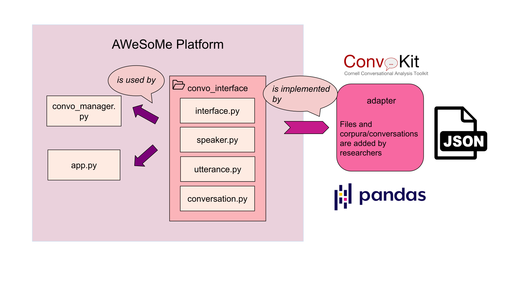

# Adapter and Interface

The interface is an abstract class with the required functions: `load()`, `get_speaker()`, `get_conversation()`, `get_conversation_ids()`, and `get_utterance()`. These functions will be inherited by adapter files, which need to be written by the researchers, because the website is unable to run without a conversation, information about the speakers from the conversation, and the text (utterance). The three classes, `conversation`, `speaker`, and `utterance`, set the basic structure and information needed to make the platform run properly. All classes have their required information, such as `id`, and optional information, which can be added as a metadata dictionary.




As a quick example, we have written out a `dummy_adapter` which you can find in backend/adapters. You can run this file to test out how the adapter and interface work. First we defined the `DummyAdapter` class which inherits from the `ConvoInterface`. We added the conversation through a Python dictionary and then shared it with the interface through our adapter file. We only wrote the required functions such as:

```python
__init__(self, data: List[Dict])
def load(self)
get_conversation_ids(self)
pick_conversation(self)
get_conversation(self, convo_id: str)
get_utterance(self, convo_id: str)
get_speaker(self, convo_id: str)
```

where we added the dictionary, `def load(self)` to build the speaker, utterance, and conversation objects, `get_conversation_ids(self)` to get the conversation ids, `pick_conversation(self)` to define how the conversation is selected (we only have one conversation so it selects this one everytime, but we have another corpus with multiple conversations and we chose to do this randomly), and `get_conversation(self, convo_id: str)`, `get_utterance(self, convo_id: str)`, `get_speaker(self, convo_id: str)` to load the conversation, utterance, and speaker.

If you would like to see more examples of how the interface and adapters are implemented, please check the `convokit_adapter` and the `demo_adapter` in `backend/adapters`. Both `dummy_adapter` and `demo_adapter` are loaded through a Python dictionary, while `convokit_adapter` uses convokit. The adapter and interface allow for any type of conversation to be supported.

Finally, once the adapter is written, researchers can load it through the `config.py` file. Here is an example of how to do this below: 
```python
from backend.adapters.dummy_adapter import DummyAdapter
from backend.adapters.test_data import DUMMY_CONVERSATION
active_adapter = DummyAdapter(DUMMY_CONVERSATION)
active_adapter.load()
```
