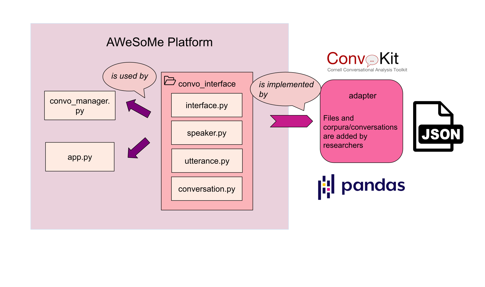

# Adapter and Interface
Our adapter and interface work together to allow researchers to add in their own conversational data without having to edit other portions of the existing website code. This lowers the technical barrier of entry and allows for researchers to spend less time creating the website. To assist with this, our interface acts as an abstract class and the adapters inherit the functions from it. This structure allows for any type of conversation to be displayed.  Below is a diagram of the interface and adapter to show how they interact with one another: 



## Interface
The interface contains an abstract class with the required functions: `load()`, `get_speaker()`, `get_conversation()`, `get_conversation_ids()`, and `get_utterance()`. These functions will be inherited by adapter files, which need to be written by the researchers, because the website is unable to run without a conversation, information about the speakers from the conversation, and the text (utterance). The three classes, `conversation`, `speaker`, and `utterance`, set the basic structure and information needed to make the platform run properly. All classes have their required information, such as `id`, and optional information, which can be added as a metadata dictionary.

## Adapter

### Define an adapter

As a quick example, we have written out a `dummy_adapter` which you can find in backend/adapters. You can run this file to test out how the adapter and interface work. First, we defined the `DummyAdapter` class, which inherits from the `ConvoInterface`. We added the conversation through a Python dictionary and then shared it with the interface through our adapter file. We only wrote the required functions such as:

```python
__init__(self, data: List[Dict])
def load(self)
get_conversation_ids(self)
pick_conversation(self)
get_conversation(self, convo_id: str)
get_utterance(self, convo_id: str)
get_speaker(self, convo_id: str)
```

where we added the dictionary, `def load(self)` to build the speaker, utterance, and conversation objects, `get_conversation_ids(self)` to get the conversation ids, `pick_conversation(self)` to define how the conversation is selected (we only have one conversation so it selects this one every time, but we have another corpus with multiple conversations and we chose to do this randomly), and `get_conversation(self, convo_id: str)`, `get_utterance(self, convo_id: str)`, `get_speaker(self, convo_id: str)` to load the conversation, utterance, and speaker.

If you would like to see more examples of how the interface and adapters are implemented, please check the `convokit_adapter` and the `demo_adapter` in `backend/adapters`. Both `dummy_adapter` and `demo_adapter` are loaded through a Python dictionary, while `convokit_adapter` uses Convokit. The adapter and interface allow for any type of conversation to be supported as long as the researchers provide a load method.

### Using an adapter

Finally, once the adapter is written, researchers can load it through the `config.py` file. 

The first step is to load the adapter. In order to do this, import the adapter class you wrote from your adapter file. Below is an example:
```python
from backend.adapters.dummy_adapter import DummyAdapter
```
In this example the adapter file is `dummy_adapter` and the class is `DummyAdapter`

Next, if your conversation needs to be separately loaded from another file, you can do this here. If your conversation is not stored in a file, you can skip this step. Below is an example: 

```python
from backend.adapters.test_data import DUMMY_CONVERSATION
```
In this example, the file is `test_data` and the file is `DUMMY_CONVERSATION`

Following this you need to set your adapter as the active adapter. We use this so that the adapters can be easily switched. You **must** use the variable `active_adapter`. Below is an example:

```python
active_adapter = DummyAdapter(DUMMY_CONVERSATION)
```
The adapter being used here is `DummyAdapter` and the conversation is `DUMMY_CONVERSATION`. 

The last step is to load the adapter. You do not need to edit this line of code. 
 ```python
active_adapter.load()
```

Putting this together. The full example is: 
```python
from backend.adapters.dummy_adapter import DummyAdapter
from backend.adapters.test_data import DUMMY_CONVERSATION
active_adapter = DummyAdapter(DUMMY_CONVERSATION)
active_adapter.load()
``` 
