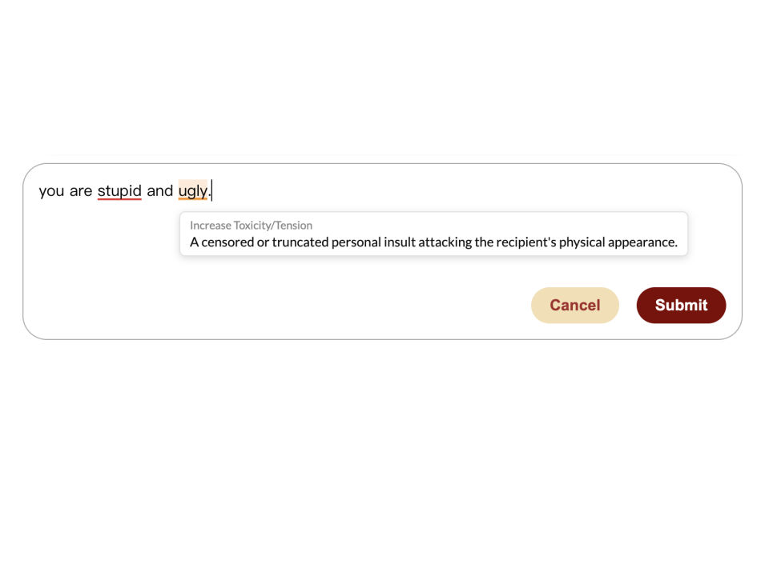

# Example: LLM-Related Intervention

As an example, we will show you how to implement an LLM-related intervention. This intervention takes in the whole conversation, the place that the participant is replying to, and the real-time text from the reply box and highlights any word or phrase that the LLM on our server thinks is toxic or is getting the conversation more intense in orange. The LLM will also give the reason for the highlighting in the tooltip. We set the LLM to be called once at least a second has passed since the last call, and the last keystroke is space or punctuation so that the user has typed a full word. If the user stopped typing for at least one second, and the draft has changed since the last LLM call, the LLM will be called again to include and analyze the whole draft.

We created an additional file called `toxicityHighlight.py` (located in `backend/services`) that calls the LLM from our server. We also import `highlight.py` into this file so we can use its functions.

To pass in the text to our LLM, we imported the function `call_llama()` from `calLllamaSCD.py`. This has the information for the LLM, which runs on our server. To use an LLM-powered intervention, make sure to switch this information to your server and LLM.

`toxicityHighlight.py` has a prompt that gives the LLM the conversation and the place the participant is replying to as context, and the text as participants type their comments. The LLM is then asked to flag items which it finds to be toxic and store them as a JSON object with `[{"phrase/word": "...", "reason": "..."}]`. An example of this would be `[{phrase: “You are ugly”, reason: “A direct personal insult attacking the recipient's physical appearance."}]`. This can then be used to tell the front end what should be highlighted. Additionally, the reason can be added to the tooltip. The toxicity highlighting also doesn’t overlap with the trigger word highlighting. If a word is already highlighted as a trigger word, it will not be highlighted by the LLM even if it is toxic.

We then added toxicity highlighting as a variant in `highlighting.js`. By defining highlights as `VARIANTS`, multiple highlight types can render at once. We used this to display both the trigger words and LLM-generated toxicity highlights at the same time. In the variant entry, the researcher can set a generic fallback tooltip label if the LLM's generated feedback does not work. The LLM-generated reasoning occurs on a separate path: each flagged phrase's specific reason is attached directly to its `[start, end, reason]` range in `get_payload()`, sent to the frontend as part of `highlight_indices`, and read directly by the tooltip code (`range.reason`) — which always takes priority over the variant's generic fallback text. So as long as `get_payload()` returns a reason for each range, no other change is needed to get that specific reasoning to display. If the LLM does not return a reason, the default logic the researcher selected will be displayed in its place.

```javascript
const VARIANTS = {
   default: {
       cssClass:   'trigger-word',
       hoverClass: 'trigger-word-hover',
       label:      'Trigger Word',
       body:       'Please consider avoiding this word'
   },
   toxicity: {
       cssClass:   'toxicity-word',
       hoverClass: 'toxicity-word-hover',
       label:      'Increase Toxicity/Tension',
       // Fallback only — in practice each highlight carries its own
       // `reason` string returned by the LLM (see showTooltip), which
       // always takes priority over this generic body text.
       body:       'This may increase tension in the conversation'
   },
};
```

If the researcher does not want and LLM generated reason and instead a static reason like in the trigger word highlighting. They can add this above in the `label` and `body` sections.

In `ensurStyles()`, we also opted to change the color of the toxicity highlight (because we had two highlights going at once). However, if the researcher did not want to change the color of the highlight, they would be able to just replace our trigger words highlight with theirs. Below is an example of both the trigger words and toxicity highlighting:



As you can see, both can be displayed at the same time. We also asked the LLM to avoid overlapping the two kinds of highlights by giving it the Trigger Words list and asking it to not flag these words. The two colors avoid user confusion by showing that they are highlighting for different reasons. Below is the code responsible for the highlighting colors in `ensurStyles()`.

```css
.highlights-container .trigger-word {
    background-image: repeating-linear-gradient(to right, #e53935 0, #e53935 4px);  /* red */
}
.highlights-container .trigger-word.hovered {
    background-color: rgba(229, 57, 53, 0.18);
    ...
}
.highlights-container .toxicity-word {
    background-image: repeating-linear-gradient(to right, #fb8c00 0, #fb8c00 4px);  /* orange */
}
.highlights-container .toxicity-word.hovered {
    background-color: rgba(251, 140, 0, 0.18);
    ...
}
```

Moreover, we combined the pop-up intervention in `toxicityHighlight.py`. When the participant tries to submit a comment with LLM-highlighted content in it, the pop-up window will show all the reasons that the LLM generated in the tooltips, and ask the participant to consider revising their post. We implemented this by importing the `PopupIntervention` to `toxicityHighlight.py` and writing a class inheriting from it. Please note that this pop-up box replaced the trigger-words pop-up box, which means that when there are both kinds of highlighted contents in the post, the pop-up box will show the LLM-generated reasons instead of the trigger-words advice. All formats of the pop-up box follow the default format, so `toxicityHighlight.py` is the only place that we wrote code about this pop-up box.

Finally, once the specific intervention has been created, we added it as an object in the Intervention section of `app.py`. If the researchers want to quickly disable this intervention, they can just comment out this object here.

```python
INTERVENTIONS = [

   ContextualToxicityHighlightingIntervention(
       trigger_event="onText"
   ),

]
```
