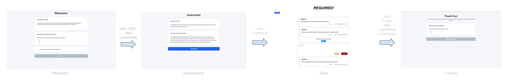
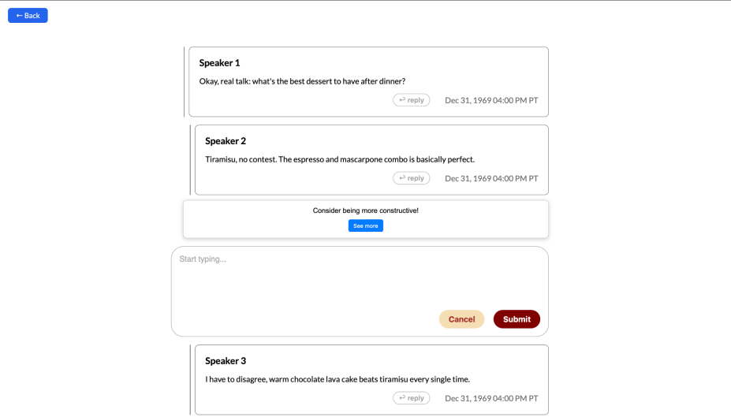
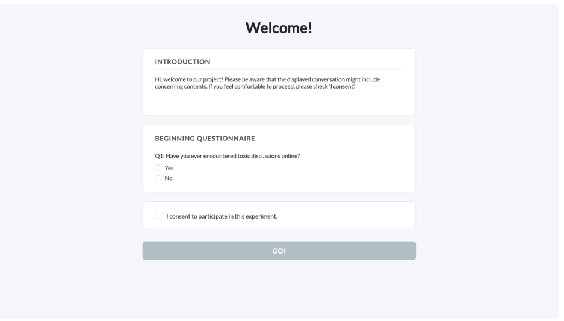
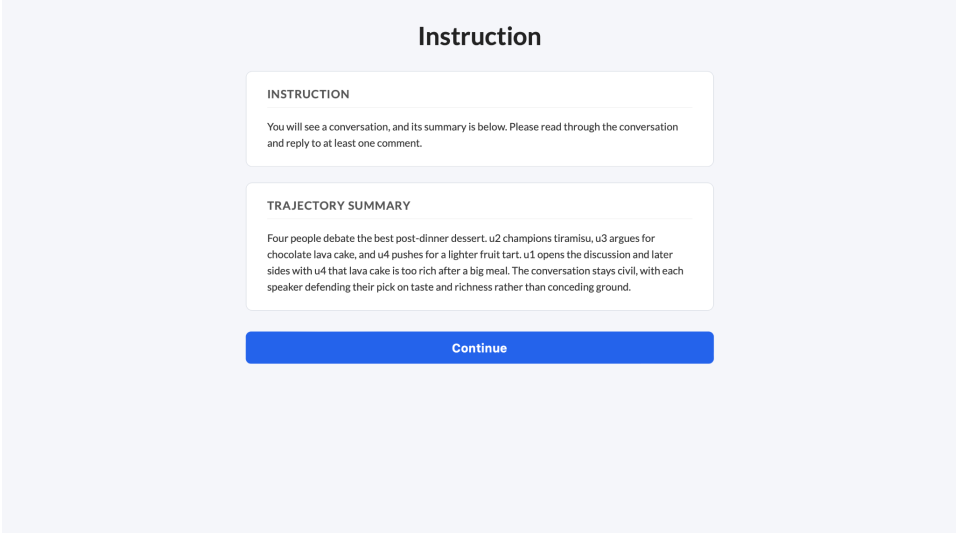
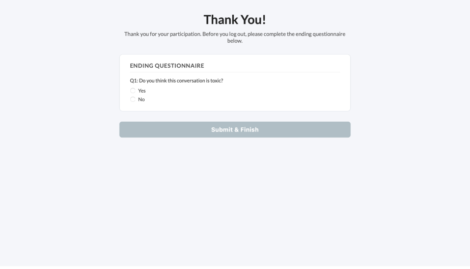

# Platform Structure

The order in which the pages appear and how users navigate through them is shown in the figure below.



Our website consists of three optional pages—the welcome page, instructions page, and ending page—and one required page, the chat page. Each page serves a different purpose and can be customized by the researcher. To learn more about each page and its features, continue reading.

## Main Page 

The main purpose of this website is to facilitate research surrounding conversational interventions. Because of this, our main page is the chat page. It allows researchers to display their own conversational data and for participants to interact with it. 

### Chat Page

The goal of this page is to display the researcher's conversational data and replicate an online social media environment. This is the most important page on our website. It allows users to reply to the conversation and interact with interventions. To learn more about implementing and customizing interventions, see the **[Interventions](interventions.md)** section. Researchers can load their own conversations through the adapter and interface. To learn more about connecting your own conversational data to the platform, see the **[Adapter and Interface](adapter-and-interface.md)** section.



The chat page also comes with some optional miscellaneous features, which we will describe below.

Our timer is currently set to a reading speed of 1000 words per minute, as participants are likely skimming the content and not deeply reading it. This can be changed in `app.py`, where the researcher can change `1000` to whatever reading speed they would like. When the timer is still counting down, the participants can type in the reply box, but they can't submit the reply.

```python
all_text = " ".join(utt.text for utt in convo.iter_utterances() if utt.text)
word_count = len(re.findall(r'\w+', all_text))
reading_seconds = max(10, (word_count / 1000) * 60)
```

We set the minimum comment length to 10 characters, but this can be changed in `settings.json`.

Our website also allows researchers to decide whether they would like participants to be able to respond anywhere in the conversation or just the last comment.

In order for the researcher to turn on these optional features, they must set them to `true` in the `settings.json` file.

To learn more about these optional features, see the **[Settings Configuration](settings-configuration.md)** section.

## Additional Pages 

### Welcome Page

When the researcher first loads our platform, they will see a welcome page. This consists of introduction, survey, and consent sections. Each section is customizable in `welcome.html`. Researchers can add their own custom introduction and survey. They can also optionally toggle off the survey in the `settings.json` file if they do not want it displayed on the page. Information about this can be found in the **[Settings Configuration](settings-configuration.md)** section. For more information about how to edit this page, please see the **[Surveys and Additional Pages](surveys-and-additional-pages.md)** section.



### Instructions Page

The instructions page shows instructions and an optional summary section. The instructions section is where researchers can add more specific information about what they want the users to do during the study. The summary section can be used to display a summary of the conversation if the researcher has one stored in the metadata. If there is no summary stored, this section will not appear. If they have a summary stored but do not want it displayed, they can toggle this off in the settings. Information about this can be found in the **[Settings Configuration](settings-configuration.md)** section. For more information about how to edit this page, please see the **[Surveys and Additional Pages](surveys-and-additional-pages.md)** section.



### Ending Page

Once the user has completed interacting with the chat page, they will move on to the ending page. This consists of a customizable message that thanks participants for their time and an optional ending questionnaire. The message and questionnaire can both be edited in `ending.html`. To learn more about editing the ending page and questionnaire, see the **[Surveys and Additional Pages](surveys-and-additional-pages.md)** section.


